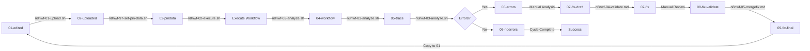

# N8N Workflow Development File Lifecycle

## Overview

The n8n workflow development process follows a structured lifecycle with specific file states and transitions. This document outlines the complete file lifecycle used in the hyly-extension workflow automation system.

## File System Structure

The lifecycle uses **timestamped files** within the workflow-directory, not separate directories for each stage:

```
/home/mg/src/n8n-mcp-hyly/hyly-extension/workflow-directory/
├── YYYYMMDD-HHMMSS-{workflowId}-01-edited.json      # Stage 01: Edited versions
├── YYYYMMDD-HHMMSS-{workflowId}-02-uploaded.json    # Stage 02: Uploaded to n8n
├── YYYYMMDD-HHMMSS-{workflowId}-02-pindata.json     # Stage 02: PinData for workflow
├── YYYYMMDD-HHMMSS-{workflowId}-04-workflow.json    # Stage 04: Post-execution workflow
├── YYYYMMDD-HHMMSS-{workflowId}-05-trace-{execId}.json  # Stage 05: Execution trace
├── YYYYMMDD-HHMMSS-{workflowId}-06-errors-{execId}.json # Stage 06: Error analysis
├── YYYYMMDD-HHMMSS-{workflowId}-06-noerrors-{execId}.json # Stage 06: No errors found
├── YYYYMMDD-HHMMSS-{workflowId}-07-fix.md           # Stage 07: Fix documentation
├── YYYYMMDD-HHMMSS-{workflowId}-07-fix-draft.json   # Stage 07: Draft fix
├── YYYYMMDD-HHMMSS-{workflowId}-07-root-cause.md    # Stage 07: Root cause analysis
├── YYYYMMDD-HHMMSS-{workflowId}-08-fix-validate.md  # Stage 08: Fix validation
├── YYYYMMDD-HHMMSS-{workflowId}-09-fix-final.json   # Stage 09: Final fix ready
└── YYYYMMDD-HHMMSS-post-mortem.md                   # Post-mortem analysis
```

**File Naming Convention:**
- `YYYYMMDD-HHMMSS`: Eastern timezone timestamp
- `{workflowId}`: n8n workflow ID (e.g., `6TApNCFdO6tZkK9I`)
- `{execId}`: n8n execution ID (e.g., `16784`)
- Stage number indicates lifecycle phase
- File extension indicates format (`.json` for workflow data, `.md` for documentation)

## Lifecycle Stages

### Stage 01: Edited Workflow (`*-01-edited.json`)
- **Purpose**: Local workflow edits ready for upload
- **Format**: Complete workflow JSON with modifications
- **Operations**: Manual editing, IDE-based modifications, MCP validation
- **Tools Used**: MCP `validate_workflow`, direct file editing
- **Next Stage**: Upload to n8n (Stage 02)

### Stage 02: Uploaded Workflow (`*-02-uploaded.json`)
- **Purpose**: Timestamped copy uploaded to n8n server  
- **Format**: Workflow JSON as uploaded to n8n
- **Operations**: 
  - Upload to n8n via API with database verification
  - Workflow activation/deactivation
  - Database direct write + API verification (hybrid approach)
- **Scripts**: `n8nwf-01-upload.sh`
- **Next Stage**: Execute workflow, then capture (Stage 04)

### Stage 02: PinData (`*-02-pindata.json`)
- **Purpose**: PinData associated with uploaded workflow
- **Format**: JSON object with node-wrapped pinData for workflow execution
- **Operations**:
  - Set via direct database update (n8n API rejects pinData in PUT requests)
  - Auto-wrap with trigger node name for UI visibility
  - Support for complex data up to 36KB+ from sources like Notion
- **Scripts**: `n8nwf-97-set-pin-data.sh`
- **Next Stage**: Execute workflow with pinData (Stage 04)

### Stage 04: Post-Execution Workflow (`*-04-workflow.json`)
- **Purpose**: Workflow state capture after execution
- **Format**: Complete workflow definition post-execution
- **Operations**:
  - Download workflow definition after execution
  - Capture any runtime modifications  
  - Document node state changes
- **Tools**: MCP `n8n_get_workflow`, `n8n-100-workflow-extract.sh`
- **Next Stage**: Execution trace analysis (Stage 05)

### Stage 05: Execution Trace (`*-05-trace-{execId}.json`)
- **Purpose**: Complete execution data and performance logs
- **Format**: Full n8n execution JSON with all node data
- **Operations**:
  - Download execution data via MCP `n8n_get_execution`
  - Parse execution results and node outputs
  - Performance and timing analysis
- **Scripts**: `n8n-11-execution-extract.sh`
- **Next Stage**: Error analysis if failures detected (Stage 06)

### Stage 06: Error Analysis (`*-06-errors-{execId}.json` / `*-06-noerrors-{execId}.json`)
- **Purpose**: Error extraction and failure analysis
- **Format**: 
  - `*-06-errors-*.json`: Structured error data from failed executions
  - `*-06-noerrors-*.json`: Success confirmation with minimal data
- **Operations**:
  - Extract error details and stack traces
  - Node failure point identification
  - Success/failure determination
- **Scripts**: `n8n-31-execution-analyze.sh`
- **Next Stage**: Fix development if errors found (Stage 07)

### Stage 07: Fix Development (`*-07-fix.md`, `*-07-fix-draft.json`, `*-07-root-cause.md`)
- **Purpose**: Error analysis and fix development
- **Format**: 
  - `*-07-fix.md`: Human-readable fix documentation
  - `*-07-fix-draft.json`: Draft workflow fixes
  - `*-07-root-cause.md`: Detailed root cause analysis
- **Operations**:
  - Root cause analysis from execution errors
  - Fix development and documentation
  - Code corrections and logic improvements
- **Scripts**: `n8n-34-workflow-fix.sh`, `n8n-32-fix-validate.sh`
- **Next Stage**: Fix validation (Stage 08)

### Stage 08: Fix Validation (`*-08-fix-validate.md`)
- **Purpose**: Fix validation and testing plan
- **Format**: Markdown documentation of fix validation
- **Operations**:
  - MCP validation of proposed fixes
  - Test plan development
  - Fix readiness assessment
- **Tools**: MCP `validate_workflow`, `validate_node_operation`
- **Next Stage**: Final fix preparation (Stage 09)

### Stage 09: Final Fix (`*-09-fix-final.json`)
- **Purpose**: Final validated fix ready for application
- **Format**: Complete workflow JSON with fixes applied
- **Operations**:
  - Final validation and preparation
  - Ready to return to Stage 01 for next cycle
  - Complete workflow with tested fixes
- **Next Stage**: Copy to Stage 01 (cycle restart)

## Interaction Methods

### 1. API Calls (REST API)
- **Usage**: Read-only operations, verification
- **Endpoint**: `http://n8n:5678/api/v1/`
- **Authentication**: `X-N8N-API-KEY` header
- **Pros**: Clean, standardized, documented
- **Cons**: Slower, includes activation side effects for updates
- **Scripts**: `n8n-100-workflow-extract.sh`, `n8n-11-execution-extract.sh`

### 2. Direct Database Access (SQLite)
- **Usage**: Fast workflow updates without activation
- **Access**: `docker exec n8n` with SQLite operations
- **Database**: `/home/node/.n8n/database.sqlite`
- **Pros**: Fastest updates, bypasses processing overhead
- **Cons**: Requires restart for activation, no validation, consistency risks
- **Scripts**: `n8n-120-workflow-upload.sh` (hybrid mode)

### 3. MCP (Model Context Protocol)
- **Usage**: Documentation, validation, tool discovery
- **Access**: Via MCP server tools (`mcp__n8n-mcp__*`)
- **Pros**: Rich toolset, integrated validation
- **Cons**: Slower, inconsistent performance, limited to available tools
- **Scripts**: `n8n-mcp-00-test.sh`

## Cycle Flow



## Key Scripts by Stage

| Stage | Primary Script | Secondary Scripts | Method |
|-------|---------------|-------------------|---------|
| 01 | Manual editing | `n8nwf-04-validate.md` | Local + MCP Validation |
| 02 | `n8nwf-01-upload.sh` | `n8nwf-97-set-pin-data.sh`, `n8nwf-98-set-folder.sh` | API + Direct DB |
| 04 | `n8nwf-03-analyze.sh` | - | API |
| 05 | `n8nwf-03-analyze.sh` | - | API |
| 06 | `n8nwf-03-analyze.sh` | - | API + Analysis |
| 07 | Manual analysis | `n8nwf-04-validate.md` | Local + MCP Validation |
| 08 | `n8nwf-04-validate.md` | - | MCP Validation |
| 09 | `n8nwf-05-mergefix.md` | - | Local Processing |

## Best Practices

### File Naming
- Use timestamps: `YYYYMMDD-HHMMSS-`
- Include workflow name
- Add stage prefix where appropriate

### Version Control
- Each stage maintains its own file versions
- Timestamps provide natural versioning
- Git tracks script changes, not workflow files

### Consistency
- API for workflow operations and analysis (148x faster than CLI)
- Direct DB for pinData and folder operations (API rejects pinData)
- MCP for validation and complex analysis tasks
- Database verification instead of API re-downloads

### Safety
- Database before/after verification for uploads
- Maintain lifecycle files for traceability
- Use hybrid approaches (API + DB verification) for critical operations
- No 2-second sleeps - measure actual timing needs

---

*Updated: 2025-09-08*
*Project: hyly-extension workflow automation system*